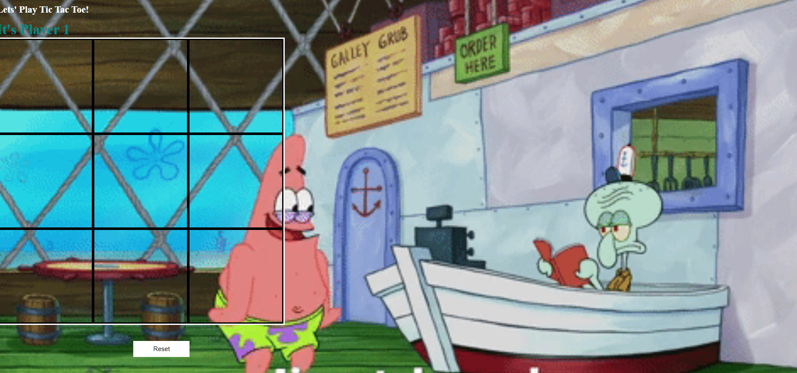

#  📌 Tic Tac Toe

**Goal:** Create a simple  tic tac toe game with a reset button and score counter

**Link to project:** TBA

## How It's Made:

  **Languages used:**  HTML, CSS, JavaScript

  - When a player clicks on on of the square, it triggers an event listener to check if there a winning combination and increase the score
  if not continue the game. press the reset button to clear the board.
